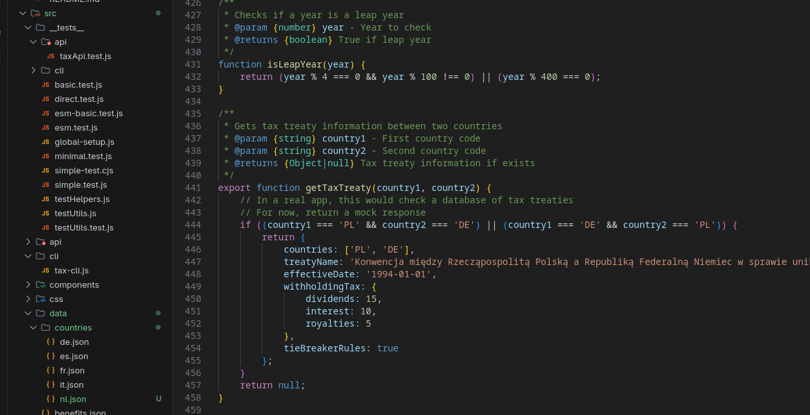

# Multi-Country Tax & Cost of Living Comparison Tool



A comprehensive web application for comparing tax, benefits, and cost of living across multiple countries. This tool helps individuals, digital nomads, and businesses understand their financial obligations and lifestyle costs in different jurisdictions.

## ✨ Features

- **Multi-Country Comparison**: Compare tax scenarios across multiple countries simultaneously
- **Business Support**: Support for various business types (production, trade, services, freelance, e-commerce)
- **Family Benefits**: Calculate family and children benefits (500+, 800+, Kindergeld, etc.)
- **Cost of Living**: Detailed cost of living comparisons across cities
- **Custom Scenarios**: Create and save custom business and family scenarios
- **Interactive Visualizations**: Charts and graphs for easy comparison
- **Responsive Design**: Works on desktop and mobile devices
- **REST API**: Programmatic access to tax and cost calculations
- **CLI Interface**: Command-line interface for quick calculations

## 🚀 Getting Started

### Prerequisites

- Node.js 18+ (LTS recommended)
- npm or yarn
- Git

### Installation

1. Clone the repository:

   ```bash
   git clone https://github.com/yourusername/tax-comparison-tool.git
   cd tax-comparison-tool
   ```

2. Install dependencies:

   ```bash
   npm install
   ```

3. Start the development server:

   ```bash
   npm run dev
   ```

4. Open [http://localhost:3000](http://localhost:3000) in your browser

## 🏗️ Project Structure

```text
tax-comparison-tool/
├── src/                    # Source code
│   ├── components/         # React components
│   ├── contexts/           # React contexts
│   ├── pages/              # Page components
│   ├── services/           # Business logic and API clients
│   ├── utils/              # Utility functions
│   └── __tests__/          # Test files
├── public/                 # Static files
├── data/                   # Data files
│   ├── countries/          # Country-specific data
│   ├── benefits.json       # Benefits data
│   └── cost-of-living/     # Cost of living data
├── scripts/                # Utility scripts
├── .github/                # GitHub configurations
├── .vscode/                # VS Code settings
├── dist/                   # Build output
├── coverage/               # Test coverage reports
└── docs/                   # Documentation
```

## 🛠️ Services

Key services in the application:

- **Benefit Calculator**: Handles calculation of various benefits
- **Data Service**: Manages loading and accessing country data
- **Tax Calculator**: Core tax calculation logic

## 📊 Data Structure

The application uses a modular data structure with separate files for different aspects:

- Country-specific data in `data/countries/`
- Benefits configuration in `data/benefits.json`
- Cost of living data in `data/cost-of-living/`

## 🧪 Testing

Run tests using the following commands:

```bash
# Run all tests
npm test

# Run specific test suites
npm run test:unit    # Unit tests
npm run test:api     # API tests
npm run test:cli     # CLI tests
```

## 🤝 Contributing

Contributions are welcome! Please see our [Contributing Guidelines](CONTRIBUTING.md) for details.

## 📄 License

This project is licensed under the MIT License - see the [LICENSE](LICENSE) file for details.
│   │   ├── eventHandlers.js
│   │   ├── tableUpdater.js
│   │   ├── taxCalculator.js
│   │   └── templateLoader.js
│   └── app.js               # Main application entry point
├── index.html               # Main HTML file
└── README.md                # This file
```

## Getting Started

1. **Prerequisites**
   - Modern web browser (Chrome, Firefox, Safari, Edge)
   - Node.js (for development)

2. **Installation**
   ```bash
   # Clone the repository
   git clone https://github.com/founder-pl/form.git
   cd form
   
   # Install dependencies (if any)
   npm install
   
   # Start development server (if configured)
   npm run dev
   ```

3. **Usage**
   - Open `index.html` in your web browser
   - Select countries to compare
   - Enter your financial and personal details
   - View and compare tax scenarios

## Data Model

The application uses the following main data structures:

### Country Data
```javascript
{
  "PL": {
    "name": "Poland",
    "flag": "🇵🇱",
    "eu": true,
    "vat": 23,
    "taxIncome": {
      "production": 19,
      "trade": 19,
      "services": 19,
      "freelance": 12,
      "ecommerce": 19
    },
    "socialSecurity": 1500,
    "notes": "Additional country-specific notes"
  }
}
```

### Family Data
```javascript
{
  "maritalStatus": "single",
  "spouseLocation": "PL",
  "unemploymentStatus": "none",
  "children": [
    {
      "name": "Anna",
      "age": 5,
      "isNewborn": false,
      "isStudent": false,
      "isDisabled": false
    }
  ]
}
```

## Extension Points

The application is designed to be extensible. Here are the main extension points:

1. **Adding New Countries**
   - Add country data to `data/countries.json`
   - Add benefit information to `data/benefits.json`

2. **Custom Tax Calculations**
   - Implement custom tax logic in `taxCalculator.js`
   - Use the `getCustomTaxCalculation` hook for country-specific rules

3. **Additional Benefits**
   - Add new benefit types in `benefitCalculator.js`
   - Update the UI components to display new benefit types

## Development

### Building
```bash
# Build for production
npm run build
```

### Testing
```bash
# Run tests
npm test
```

### Code Style
- Follow [Airbnb JavaScript Style Guide](https://github.com/airbnb/javascript)
- Use ESLint for code linting
- Write JSDoc comments for all functions

## License

This project is licensed under the MIT License - see the [LICENSE](LICENSE) file for details.

## Acknowledgments

- Bootstrap 5 for responsive design
- Font Awesome for icons
- All contributors who helped improve this tool

## Roadmap

- [ ] Add more countries and regions
- [ ] Implement more detailed tax calculations
- [ ] Add support for historical tax rates
- [ ] Create user accounts for saving scenarios
- [ ] Add more visualization options (charts, graphs)
- [ ] Improve mobile experience
- [ ] Add more documentation and examples